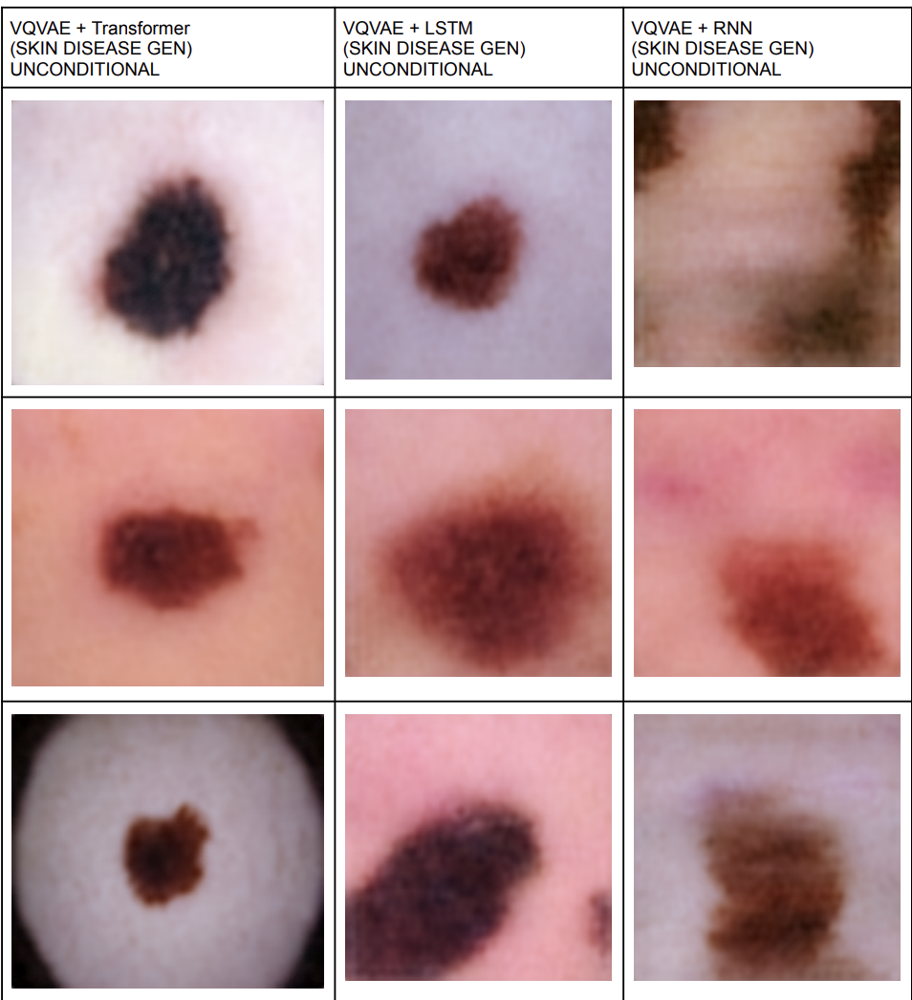
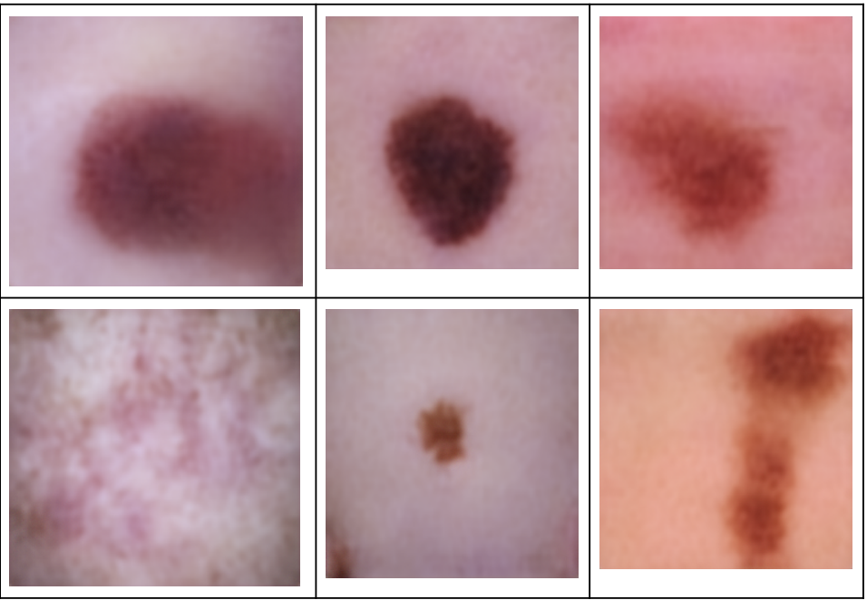

# Skin Lesion Image Generation using VQVAE, Transformer, LSTM and RNN

## Introduction

This project focuses on generative modeling of skin lesion images from the ISIC 2016 Skin Disease Dataset.

The objective is to learn the underlying distribution of skin lesion images and generate realistic synthetic samples using latent token generation.

Three different sequence models are explored:

* VQVAE + Transformer
* VQVAE + LSTM
* VQVAE + RNN

The VQVAE first compresses skin images into discrete latent codebook indices. These latent tokens are then modeled using Transformer, LSTM, and RNN architectures to generate new skin lesion images.

---

# Results

## VQVAE + Transformer

<p align="center">
  
</p>

<p align="center">
  
</p>
---

# MORE Test Data Results[TRANSFORMER , RNN, LSTM] 

🔗 https://drive.google.com/drive/folders/1EViWVS-LFkJYwfZwSN6noD-dHtR3S9nk?usp=drive_link

---
# Google Colab

Run the project directly in Google Colab:

🔗 https://drive.google.com/file/d/1QzKfTirUaaf_yQWq4063z9QLLPaKNvL9/view?usp=drive_link

---

# Handwritten Report

Complete derivations, architecture explanations, and implementation details:

📄 https://drive.google.com/file/d/1vokqgu6LAR6vWF-6XprTrD8JGJxpvjEs/view?usp=drive_link

---

# Models

## VQVAE

📦 https://drive.google.com/file/d/1noNh3BTCiDTadxWkwEiwcRVena_MYiS6/view?usp=drive_link

## Transformer

📦 https://drive.google.com/file/d/1Wjsij9r-nndhn5BVhorcJnunvi6twVfy/view?usp=drive_link

## LSTM

📦 https://drive.google.com/file/d/1UMdnSwClbJquaphuYREZYvZ6ypeBxhbZ/view?usp=drive_link

## RNN

📦 https://drive.google.com/file/d/150EDzshWEq9muCUTYWwZmQoa-c94YvG7/view?usp=drive_link

---

# Theory

## Dataset

### ISIC 2016

The International Skin Imaging Collaboration (ISIC) dataset contains dermoscopic images of skin lesions.

The dataset is widely used for:

* Skin lesion analysis
* Skin cancer research
* Medical image generation
* Representation learning

---

# Stage 1 : Vector Quantized Variational Autoencoder (VQVAE)

## Motivation

Traditional Variational Autoencoders use continuous latent spaces.

VQVAE introduces a discrete latent representation using a learnable codebook.

Instead of encoding an image into continuous vectors, the encoder maps image features to the nearest codebook vectors.

This enables stable latent generation and token-based image synthesis.

---

## VQVAE Architecture

```text
Image
   ↓
Encoder
   ↓
Latent Features
   ↓
Vector Quantization
   ↓
Codebook Vectors
   ↓
Decoder
   ↓
Reconstructed Image
```

### Components

* Encoder
* Codebook
* Quantization Layer
* Decoder
* Straight Through Estimator

---

## Loss Function

The VQVAE training objective contains:

* Reconstruction Loss
* Codebook Loss
* Commitment Loss

Final Loss:

```text
L =
Reconstruction Loss
+
Codebook Loss
+
Commitment Loss
```

---

# Stage 2 : Transformer-based Generation

After training VQVAE, every image is represented as a sequence of codebook indices.

The Transformer learns the probability distribution of the next codebook token given all previous tokens.

### Components

* Token Embedding
* Positional Embedding
* Causal Attention
* Feed Forward Network
* Layer Normalization

### Advantages

* Captures long-range dependencies
* Parallel training
* High-quality image generation

The Transformer predicts codebook indices autoregressively and the generated indices are passed through the VQVAE decoder to synthesize skin lesion images.

---

# Stage 3 : LSTM-based Generation

The Long Short-Term Memory (LSTM) network is used as a sequence model for codebook token generation.

### Components

* Forget Gate
* Input Gate
* Candidate Memory
* Output Gate

The LSTM processes latent codebook indices sequentially and predicts the next token at every timestep.

### Advantages

* Better memory than vanilla RNN
* Handles long sequences
* Stable training

---

# Stage 4 : RNN-based Generation

A Recurrent Neural Network is used as a baseline autoregressive model.

The RNN updates its hidden state recursively:

```text
Current Token
      ↓
Hidden State Update
      ↓
Next Token Prediction
```

### Advantages

* Simple architecture
* Fast training
* Low computational cost

### Limitations

* Vanishing gradients
* Poor long-range dependency modeling

Compared to Transformer and LSTM, the RNN generally produces lower-quality generations.

---

# Generation Pipeline

```text
Skin Image
      ↓
VQVAE Encoder
      ↓
Codebook Indices
      ↓
Transformer / LSTM / RNN
      ↓
Generated Indices
      ↓
VQVAE Decoder
      ↓
Generated Skin Lesion
```

---

# GPU
* A100 GPU rented from Jarvis Labs

---

# Conclusion

This project investigates latent image generation using VQVAE combined with Transformer, LSTM, and RNN sequence models.

The Transformer demonstrates superior capability in modeling long-range dependencies between latent codebook tokens, while LSTM provides a strong recurrent baseline. The RNN serves as a lightweight baseline for comparison.

The study highlights how discrete latent representations can be combined with autoregressive sequence models for high-quality medical image generation.

---

## Author

**Pranav Deshpande**
IIT Jodhpur
* Deep Learning 
* Medical Imaging 
* Generative AI

